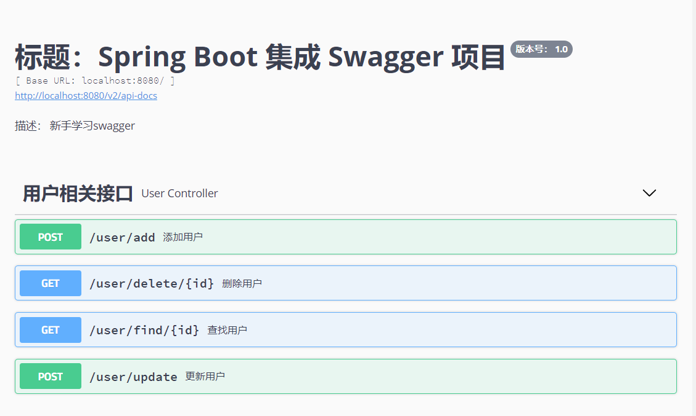
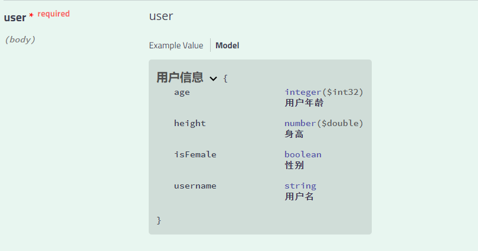

## springboot与Swagger

### Swagger简介

Swagger是一套基于OpenAPI规范构建的开源工具，可以帮助我们设计，构建，记录和使用REST API。Swagger的主要工具包括：

* Swagger编辑器：基于浏览器的编辑器，可以在其中编写OpenAPI规范。
* Swagger-ui：将OpenAPI规范以交互式文档的形式呈现。
* Swagger-Codengen - 根据OPenAPI规范生成服务器存根和客户端库。

### Swagger入门

首先创建一个Springboot项目，该项目可以很简单，不需要数据库，直接返回数据即可。

然后就是导入相关依赖：

~~~
<dependency>
            <groupId>io.springfox</groupId>
            <artifactId>springfox-swagger2</artifactId>
            <version>2.9.2</version>
        </dependency>
        <dependency>
            <groupId>io.springfox</groupId>
            <artifactId>springfox-swagger-ui</artifactId>
            <version>2.9.2</version>
        </dependency>
~~~

swagger-ui依赖可以帮我们实现一个可视化的API操作界面。

访问地址一般是：**ipaddress:port/context-path/swagger-ui.html** 

> context-path是项目的启动路径

##### swagger配置类

~~~java
@Configuration //该注解是告诉springboot要加载该配置类
@EnableSwagger2 //该注解是swagger的注解，加上这个注解表示使用swagger，下面的配置才有用
public class SwaggerConfig
{
	//注册组件，组件名可以任意，返回的对象必须是Docket
    @Bean
    public Docket createRestApi()
    {
        return new Docket(DocumentationType.SWAGGER_2)
                // 是否启用Swagger
                .enable(enabled)
                // 用来创建该API的基本信息，展示在文档的页面中（自定义展示的信息）
                .apiInfo(apiInfo())
                // 设置哪些接口暴露给Swagger展示
                .select()
                // 扫描所有有注解的api，用这种方式更灵活
                .apis(RequestHandlerSelectors.withMethodAnnotation(ApiOperation.class))
                // 扫描指定包中的swagger注解        //.apis(RequestHandlerSelectors.basePackage("com.ruoyi.project.tool.swagger"))
                // 扫描所有 .apis(RequestHandlerSelectors.any())
                .paths(PathSelectors.any())
                .build()
                /* 设置安全模式，swagger可以设置访问token ，以下配置看情况添加*/
                .securitySchemes(securitySchemes())
                .securityContexts(securityContexts())
                .pathMapping(pathMapping);
    }
	@Bean
    public ApiInfo apiInfo() {
        return new ApiInfoBuilder()
                .title("标题：Spring Boot 集成 Swagger 项目")
                .description("描述： 新手学习swagger")
            //第一个参数是名字，第二个参数是url，第三个参数是邮箱
                .contact(new Contact("gugugu",null,null))
                .version("版本号： " + 1.0)
                .build();
        //还可以添加一些其它信息，比如许可证，扩展等等信息
~~~

#### 注解

* **@Api** 通过在控制器类上加注解，可以给控制器增加描述和标签信息

  主要属性：

  | 注解属性    | 类型     | 描述                             |
  | ----------- | -------- | -------------------------------- |
  | tags        | String[] | 控制器标签                       |
  | description | String   | 描述控制器（该字段被申明为过期） |
  | hidden      | boolean  | 是否在文档中隐藏                 |

  

* **@ApiOperation** 加在方法上，主要是对接口的描述。

  | **注解属性** | **类型** | **描述**       |
  | :----------- | :------- | :------------- |
  | value        | String   | 接口说明。     |
  | notes        | String   | 接口发布说明。 |
  | tags         | Stirng[] | 标签。         |
  | response     | Class<?> | 接口返回类型。 |
  | httpMethod   | String   | 接口请求方式。 |

~~~java
@RestController
@RequestMapping("/user")
@Api(tags = "用户相关接口", hidden = false)
public class UserController {

    @ApiOperation("添加用户")
    @PostMapping("/add")
    public String add(@RequestBody User user) {
        StringBuilder builder = new StringBuilder();
        return builder.append("username:").append(user.getUsername()).append(",")
                .append("age: ").append(user.getAge()).append(",")
                .append("isFemale: ").append(user.getIsFemale()).append(",")
                .append("height: ").append(user.getHeight()).toString();
    }

    @ApiOperation("删除用户")
    @GetMapping("/delete/{id}")
    public String delete(@PathVariable @ApiParam(name = "id",value = "用户id") Integer id) {
        return "the user is deleted and it's id is " + id;
    }

    @ApiOperation("更新用户")
    @PostMapping("/update")
    public String update(@RequestBody User user) {
        return "用户更新成功";
    }

    @ApiOperation("查找用户")
    @GetMapping("/find/{id}")
    public String find(@PathVariable @ApiParam(name = "id",value = "用户id") Integer id) {
        return "未能查找到id为：" + id + "的用户";
    }
}
~~~

加上相应的注解之后，打开swagger-ui页面之后显示情况如下：

* **@ApiModel**: 可设置接口相关实体的描述

  有一个value属性，value可以省略不写

* **@ApiModelProperty**： 可设置实体属性的相关描述。

* | **注解属性**    | **类型** | **描述**                                                     |
  | :-------------- | :------- | :----------------------------------------------------------- |
  | value           | String   | 字段说明。                                                   |
  | name            | String   | 重写字段名称。                                               |
  | dataType        | Stirng   | 重写字段类型。                                               |
  | required        | boolean  | 是否必填。                                                   |
  | example         | Stirng   | 举例说明。                                                   |
  | hidden          | boolean  | 是否在文档中隐藏该字段。                                     |
  | allowEmptyValue | boolean  | 是否允许为空。                                               |
  | allowableValues | String   | 该字段允许的值，当我们 API 的某个参数为枚举类型时，使用这个属性就可以清楚地告诉 API 使用者该参数所能允许传入的值。 |

~~~java
@Data
@ApiModel("用户信息")
public class User {
    @ApiModelProperty(name = "username",value = "用户名")
    private String username;
    @ApiModelProperty(name = "age",value = "用户年龄")
    private Integer age;
    @ApiModelProperty(name = "isFemale",value = "性别")
    private Boolean isFemale;
    @ApiModelProperty(name = "height",value = "身高")
    private Double height;
}
~~~

实体类加上注解之后的效果如下：

如果我们不想要所有的接口都呈现在文档上，这种情况下swagger提供了两种方式：

* **@ApiIngnore** ： 如果不想在文档中显示接口，可以在接口上添加该注解

* 在Docket上增加筛选。Docket类提供了apis（）和paths（）两个方法来帮助我们在不同级别上过滤接口：

  ~~~
  apis(): 这种方式我们可以通过以指定包名的方式，让Swagger只去扫描有指定注解的积极而口
  paths(): 这种方式让我们可以只扫描指定的包路径
  ~~~

##### swagger-ui界面的使用：

我们可以点击try it out 来构造请求测试接口。

点击Execute之后就可以发送请求，比Postman的使用更加简单。